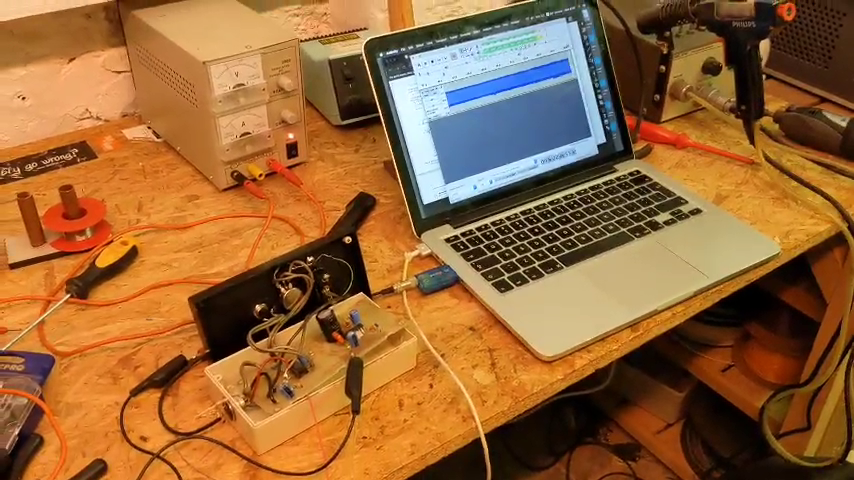

# Birk Joonas Tamm
Electronics student

dacetylan@tutanota.com | +32 494 49 62 45

## Currently

3rd year student Electronics-ICT at the AP University of Applied Sciences.

### Specialized in

Internet of Things, Microcontrollers, FPGA, PCB Design, Linux, 3D design

### Research interests

Microcontrollers, FPGA, Energy Efficient Design, 3D design

### General Knowledge

Python, NodeJS, Angular, JavaScript, TypeScript,

## Education

`2020 - present`
__AP University of Applied Sciences__

- Elektronica-ICT, Internet of Things

`2014-2020`
__Xaveriuscollege Borgerhout, Antwerp__

- Human Sciences

## Languages

__Fluent__
- |Dutch
- |Estonian

__Advanced__
- |English

__Intermediate__
- |French

__Beginner__
- |Russian
- |Flemish Sign Language

## Projects

__Flexible LoRaWAN Sensor Board__

For an <a href="https://ap-it-gh.github.io/iot-at-kist/#/">international project</a> in Zanzibar I developed an air quality sensor together with 5 other students from AP university of Applied Sciences. The PCB's were designed and produced in Belgium. In Zanzibar we set up a LoRaWAN infrastructure, assembled the PCB's, programmed the microcontrollers on the PCB's and set up a NodeRED backend. I was personally responsible for the programming of the <a href="https://ww1.microchip.com/downloads/aemDocuments/documents/MCU32/ProductDocuments/DataSheets/SAM-D21-DA1-Family-Data-Sheet-DS40001882H.pdf">microcontroller</a>.

*Helping some students from the Karume Institute of Science and Technology during a workshop around Arduino's*

__Digitization of an ice cream truck melody__

The first project I worked on at Tamm Industries was the digitization of a melody from a "music box" of my local ice cream truck. Digitizing technology from the 70's allowed him to expand his bussiness to more ice cream trucks without relying on old technology.

*Digitization of an ice cream truck melody*

__Weather station hacking__

Students from the AI division needed weather data from a weather station. Using a HackRF One I was able to intercept and decode the data from a weather station so that the students would be able to use that data to make predictions.

## Other Interests
__Climbing__

Indoor/Outdoor

__Void Warranties__

Void Warranties is a hackerspace situated in Deurne, Antwerp. I like going there to discuss technology with other like minded people.

__Film__

I'm quite interested in filmmaking. I have done some work as an extra in a TV show and I have helped on set of two short movies as a production assistant.

## Occupation
`March 2023 - present`
__E. D.& A.__, Kalmthout

- PCB Test & Repair

`December 2022 - present`
__Tamm Industries OÜ__, Tallinn

- Founding member

`2020 - 2022`
__JET, Just Eat Takeaway__, Antwerp

- Courier

`2021 - 2022`
__Mise En Place__, Antwerp

- Kitchen Aid

<!-- ### Footer

Last updated: March 2023 -->

