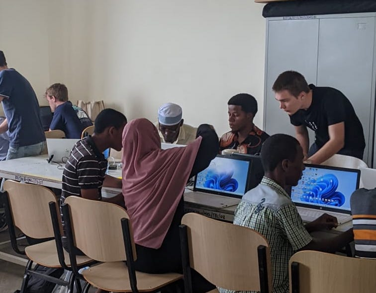
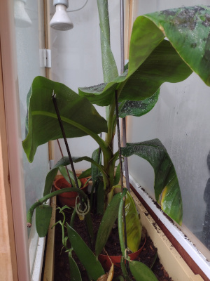

# Birk Joonas Tamm
Electronics student

dacetylan@tutanota.com | +32 494 49 62 45

## Currently

3rd year student Electronics-ICT at the AP University of Applied Sciences.
### General Knowledge

Python, NodeJS, Angular, JavaScript, TypeScript,

### Specialized in

Internet of Things, Microcontrollers, FPGA, PCB Design, Linux

### Research interests

Microcontrollers, FPGA, Energy Efficient Design

## Education

`2014-2020`
__Xaveriuscollege Borgerhout, Antwerp__

- Human Sciences

## Languages

__Fluent__
- |Dutch
- |Estonian

__Advanced__
- |English

__Intermediate__
- |French

__Beginner__
- |Russian
- |Flemish Sign Language

## Projects

__Flexible LoRaWAN Sensor Board__

For an <a href="https://ap-it-gh.github.io/iot-at-kist/#/">international project</a> in Zanzibar I developed an air quality sensor together with 5 other students from AP university of Applied Sciences. The PCB's were designed and produced in Belgium. In Zanzibar we set up a LoRaWAN infrastructure, assembled the PCB's, programmed the microcontrollers on the PCB's and set up a NodeRED backend. I was personally responsible for the programming of the <a href="https://ww1.microchip.com/downloads/aemDocuments/documents/MCU32/ProductDocuments/DataSheets/SAM-D21-DA1-Family-Data-Sheet-DS40001882H.pdf">microcontroller</a>.

*Helping some students from the Karume Institute of Science and Technology during a workshop around Arduino's*

__Home automation__

There was a need to know if our cellar had the right environnement to convert it into a wine cellar. For that I made a sensor that was based on the DHT22 and ESP32. I sent the data from this sensor to a RaspberryPi that was running <a href="https://www.home-assistant.io/">Homeassistant</a>. Later I expanded this by adding another sensor to an indoor greenhouse for my vanilla plant which I brought with me from Zanzibar

*Picture of the indoor greenhouse for the vanilla plants and a banana tree*

__Weather Station Hacking__

Students from the AI division needed weather data from a weather station. Using a HackRF One I was able to intercept and decode the data from a weather station so that the students would be able to use that data to make predictions.

## Other Interests
__Climbing__

Indoor/Outdoor

__Void Warranties__

Void Warranties is a hackerspace situated in Deurne, Antwerp. I like going there to discuss technology with other like minded people.

__Film__

I'm quite interested in filmmaking. I have done some work as an extra in a TV show and I have helped on set of two short movies as a production assistant.

## Occupation

`2020 - present`
__JET, Just Eat Takeaway__, Antwerp

- Courier

`2021 - present`
__Mise En Place__, Antwerp

- Kitchen Aid

<!-- ### Footer

Last updated: October 2022 -->

